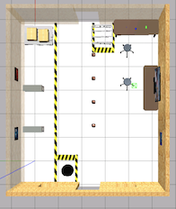
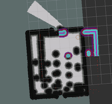
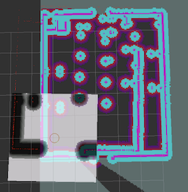
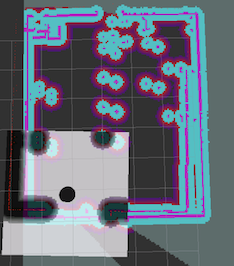

# rb1_navigation

## Part 2: ROS Navigation

Name the following web shells:
- git
- gazebo
- main
- rviz
- call go_to_point

In the **git** shell, `git clone` the `rb1_mapping`, `rb1_localization` and `rb1_navigation` packages.


In the **gazebo** shell, run
```
source ~/simulation_ws/devel/setup.bash
roslaunch rb1_base_gazebo warehouse_rb1.launch
```
Get the top-down view, so you see



In **main**:

`roslaunch rb1_navigation main.launch`

In **rviz**, start **rviz**. Load the configuration

`rb1_navigation/rviz_config/navigation.rviz`

Zoom out in rviz until you see



But rotate until it aligns with gazebo



Use the 2D Pose estimate tool to align the local and global costmaps



Use the 2D Nav Goal button to send RB-1 somewhere close by.

In `call go_to_point`, run

`rosservice call /go_to_point "label: 'initial_position'"`

After that action completes, run

`rosservice call /go_to_point "label: 'loading_position'"`
